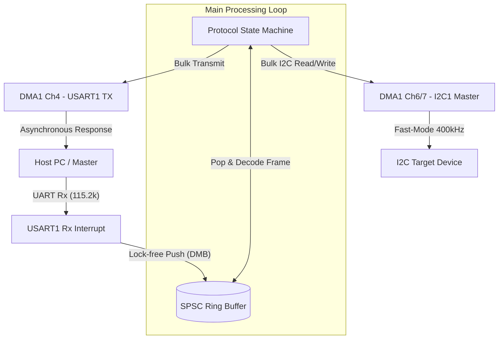

# ARM Cortex-M3 UART–I2C Protocol Bridge (STM32F103)

[](#verification--unit-tests)
[](#system-architecture)
[](#codebase-implementation)

Bare-metal **UART-to-I2C Protocol Bridge** implemented in Embedded C for the **ARM Cortex-M3** (STM32F103) microcontroller using register-level **ARM CMSIS** drivers.

## Features

- **Interrupt-Driven RX with SPSC Lock-Free Ring Buffer**: Thread-safe Single-Producer Single-Consumer (SPSC) circular queue handling incoming UART bytes. Uses hardware Data Memory Barriers (`__DMB()`) without disabling interrupts or using mutexes.
- **DMA Offloading**: Configured **DMA1 Channels 4, 6, and 7** to handle UART TX and I2C RX/TX transfers, freeing the CPU during block data operations.
- **Low-Power Sleep**: Integrated Wait For Interrupt (`__WFI`) in the main processing superloop to enter sleep mode when idle.
- **Host Unit Testing Suite**: Host-executable simulation and register mocking framework to test ring buffer and protocol decoding natively on macOS/Linux.

## System Architecture


```mermaid
graph TD
    Host[Host PC / Master] -- "UART Rx (115.2k)" --> UART_Rx_ISR[USART1 Rx Interrupt]
    UART_Rx_ISR -- "Lock-free Push (DMB)" --> Ring_Buffer[(SPSC Ring Buffer)]
    
    subgraph "Main Processing Loop"
        Parser[Protocol State Machine]
        Parser -- "Pop & Decode Frame" <--> Ring_Buffer
    end
    
    Parser -- "Bulk Transmit" --> DMA_UART_Tx[DMA1 Ch4 - USART1 TX]
    Parser -- "Bulk I2C Read/Write" --> DMA_I2C[DMA1 Ch6/7 - I2C1 Master]
    
    DMA_UART_Tx -- "Asynchronous Response" --> Host
    DMA_I2C -- "Fast-Mode 400kHz" --> I2C_Slave[I2C Target Device]
```

### Protocol Packet Specification

#### Host to Bridge (UART RX)
- **Sync Byte**: `0xAA` (1 byte)
- **Command**: `0x01` (I2C Read), `0x02` (I2C Write), `0x03` (Status Query) (1 byte)
- **Target Device Address**: 7-bit physical address (1 byte)
- **Internal Register Address**: Sub-register offset inside target device (1 byte)
- **Payload Length**: 16-bit block length `N` (2 bytes)
- **Payload Data**: Present in Write Commands (`N` bytes)
- **Checksum**: 8-bit additive modulo-256 sum of non-sync fields (1 byte)

#### Bridge to Host (UART TX Response)
- **Sync Byte**: `0x55` (1 byte)
- **Status**: `0x00` (Success), `0x01` (I2C NACK), `0x02` (I2C Timeout), `0x03` (Buffer Overflow), `0x04` (Checksum Error), `0x05` (Invalid Command) (1 byte)
- **Payload Length**: 16-bit length `M` (2 bytes)
- **Payload Data**: Retrieved data bytes for I2C Read (`M` bytes)
- **Checksum**: 8-bit additive checksum of Status + Length + Data (1 byte)

## Directory Structure

```
.
├── CMakeLists.txt              # Build configuration for target/host systems
├── Makefile                    # Utility for building and executing host tests
├── README.md                   # System documentation
├── Core
│   ├── Inc
│   │   ├── config.h            # System clock, baud rate, and I2C settings
│   │   ├── dma.h               # DMA driver interface
│   │   ├── i2c.h               # Register-level I2C master driver interface
│   │   ├── protocol.h          # Serial protocol state machine and commands
│   │   ├── ring_buffer.h       # SPSC circular buffer interface
│   │   └── uart.h              # Register-level UART driver interface
│   └── Src
│       ├── dma.c               # Register-level DMA controller configuration
│       ├── i2c.c               # Register-level I2C driver (CMSIS)
│       ├── main.c              # System initialization and main loop
│       ├── protocol.c          # Packet parser state machine
│       ├── ring_buffer.c       # SPSC ring buffer with Cortex-M memory barriers
│       └── uart.c              # Register-level UART driver (CMSIS)
├── Drivers
│   └── CMSIS                   # Microcontroller core definitions
│       ├── core_cm3.h          # Core Cortex-M3 instructions
│       └── stm32f103xb.h       # Register maps for STM32F103 peripherals
└── Tests
    ├── CMakeLists.txt          # Host test runner build configuration
    ├── mock_stm32.h            # Memory-mapped register mocks
    ├── test_protocol.c         # Protocol parsing unit tests
    ├── test_ring_buffer.c      # Ring buffer unit tests
    └── test_runner.c           # Host test entry point
```

## Verification & Unit Tests

To run the host-based unit tests natively on Linux/macOS:

```bash
make test
```

### Target Compilation (STM32F103)

To compile for the physical ARM target using `arm-none-eabi-gcc`:

```bash
arm-none-eabi-gcc -Wall -Wextra -O2 -mcpu=cortex-m3 -mthumb -mfloat-abi=soft -ffunction-sections -fdata-sections --specs=nano.specs -ICore/Inc -IDrivers/CMSIS \
  Core/Src/main.c \
  Core/Src/ring_buffer.c \
  Core/Src/uart.c \
  Core/Src/dma.c \
  Core/Src/i2c.c \
  Core/Src/protocol.c \
  -o build/m3_bridge.elf
```
